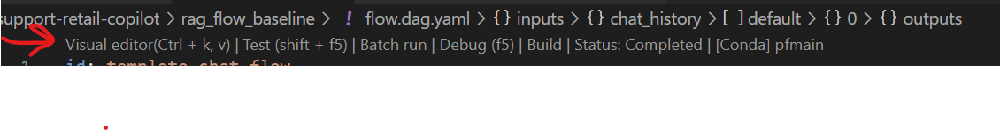
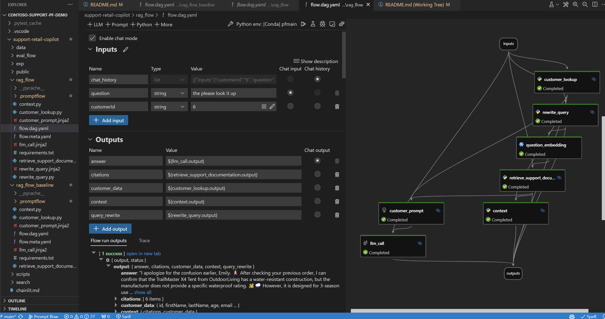

# Contoso Support Chat Prompt Flow Demo

This repository hosts the code used in the [MS Ignite 2023 | Live Breakout Session | BRK203](https://ignite.microsoft.com/en-US/sessions/16ee2bd5-7cb8-4419-95f6-3cab36dfac93)

**End-to-End AI App Development: Prompt Engineering to LLMOps**

## Introduction

Prompt engineering and LLMOps are pivotal in maximizing the capabilities of Language Models (LLMs) for specific business needs. This code base is from the End-to-End AI App Development: Prompt Engineering to LLMOps Microsoft Ignite session. We'll walk you through the entire process—from prototyping and experimenting to evaluating and deploying your AI-powered apps. Learn how to streamline your AI workflows and harness the full potential of Generative AI.

### Prerequisites

- [Azure Subscription](https://azure.microsoft.com/free/)
- [VS Code](https://code.visualstudio.com/download)
- [Prompt Flow Extension](https://marketplace.visualstudio.com/items?itemName=prompt-flow.prompt-flow)
- [anaconda](https://www.anaconda.com/products/individual) or [venv](https://docs.python.org/3/library/venv.html) to manage python environments.

## Getting Started

### Clone the repo

```bash
git clone https://github.com/microsoft/contoso-support-pf-demo.git
```

### Open the repo in VS Code

```bash
cd contoso-support-pf-demo
code .
```

### Install the Prompt Flow Extension

- Open the VS Code Extensions tab
- Search for "Prompt Flow"
- Install the extension

### Create a new python environment

#### Using anaconda

```bash
conda create -n contoso-support-pf-demo python=3.8
conda activate contoso-support-pf-demo
```

#### Using venv

```bash
python3 -m venv contoso-support-pf-demo
source contoso-support-pf-demo/bin/activate
```

### Install the requirements

```bash
pip install -r requirements.txt
```

### Building a Prompt flow

Now that the environment, extensions, and connections have been installed we can open up the prompt flow and take a look at what it does.

- Click on the flow.dag.yaml file in the explorer. If everything was installed and the python environment was activated you should see the following and select `visual editor` to view the propmt flow:


- When the flow opens you should see the following:



## Contributing

This project welcomes contributions and suggestions.  Most contributions require you to agree to a
Contributor License Agreement (CLA) declaring that you have the right to, and actually do, grant us
the rights to use your contribution. For details, visit https://cla.opensource.microsoft.com.

When you submit a pull request, a CLA bot will automatically determine whether you need to provide
a CLA and decorate the PR appropriately (e.g., status check, comment). Simply follow the instructions
provided by the bot. You will only need to do this once across all repos using our CLA.

This project has adopted the [Microsoft Open Source Code of Conduct](https://opensource.microsoft.com/codeofconduct/).
For more information see the [Code of Conduct FAQ](https://opensource.microsoft.com/codeofconduct/faq/) or
contact [opencode@microsoft.com](mailto:opencode@microsoft.com) with any additional questions or comments.

## Trademarks

This project may contain trademarks or logos for projects, products, or services. Authorized use of Microsoft 
trademarks or logos is subject to and must follow 
[Microsoft's Trademark & Brand Guidelines](https://www.microsoft.com/en-us/legal/intellectualproperty/trademarks/usage/general).
Use of Microsoft trademarks or logos in modified versions of this project must not cause confusion or imply Microsoft sponsorship.
Any use of third-party trademarks or logos are subject to those third-party's policies.
